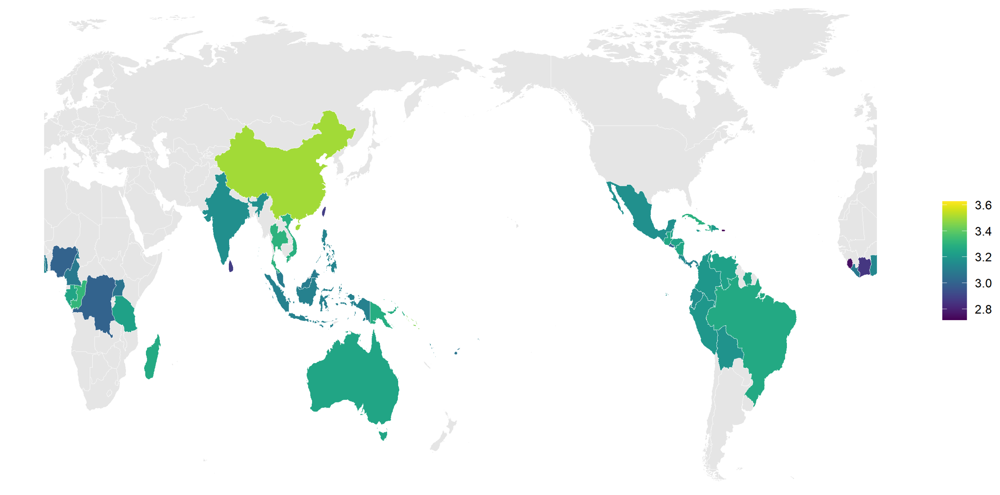

**Chocolate** is a food product manufactured from cocoa beans, which is consumed as candy and used for beverage or coat various confections and bakery products. It is rich in carbs and provides rapid energy; also, it is known to contain small amount of the stimulating alkaloids theobromine and caffeine.

 

**Data Source:** “Flavors of Cacao,” which can be retrieved from tidytuesdayR (Hughes 2022) chocolate rating data (18-01-2022).The ratings (as the Flavors of Cacao claimed) do not reflect health benefits, social missions, or organic status. 

The raw dataset includes 2530 observations and 10 variables, namely ref, company_manufacturer, company_location, review_date, country_of_bean_origin, cocoa_percent, ingredients, specific_bean_origin_or_bar_name, most_memorable_characteristics, and rating.

**Here are some glimpses from the dataset:**

 

**World map of average chocolate rating** 

 

**What's you favorite?** 

