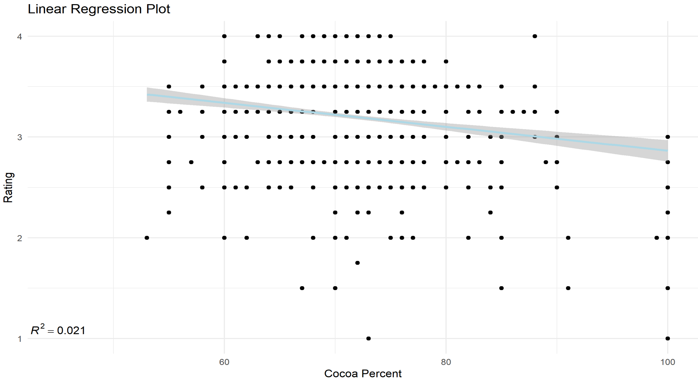
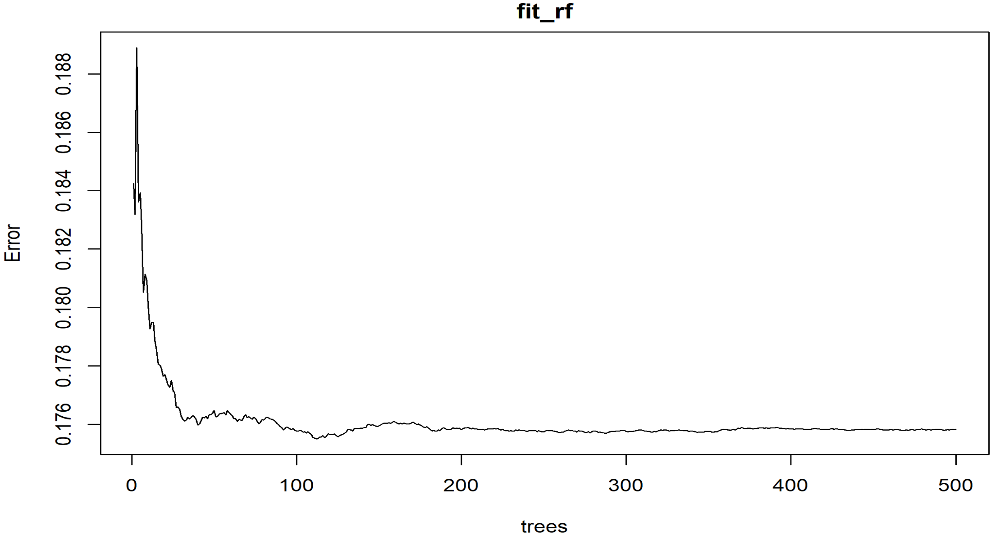

- *Linear regression model, Ridge regression model with cross validation*

We first investigate the linear relationship between rating and cocoa content with simple linear regression. The correlation coefficient between the rating and the cocoa content is -0.149. As linear regression model shown below, each additional 1% of cocoa decreases the rating by approximately 0.012 (p-value < 0.001). The adjusted R-squared is 0.02.

 

 

- *Multivariable Regression, Ridge Penalization*

Further, we take all listed ingredients into consideration while building the multivariate regression model:

 

 

From correlation plot, we recognized that the stronger correlation between sugar and sweetener, as well as the one between sugar and beans. 

 

 

In response to the presence of multicollinearity, the Ridge is utilized as the penalization method. The results give a whole path of possible coefficients, and the best-fit model can be selected with cross validation. The Ridge regression model is built with cross validated MSE. Based on calculations, the R-squared increased after Ridge method. 

 

 Ridge Regression with Cross Validation 

 

- *Random forest model with cross validation*

Due to the long computation time, the five-fold cross validation is used; in addition, the number of trees was reduced. Finally, to train on a smaller dataset, we took a random sample of the observations when constructing each tree. To check that we ran enough trees, we visualized the error rate over number of trees.

 

 

Given the disadvantage of poor interpretability, we examined variable importance, in order to count how often a predictor is used in the individual trees. From the plot, the cocoa percent is considered as the most crucial factor in the model, following by vanilla and lecithin.

 

- *K-nearest neighbors model with cross validation*

To begin the KNN modeling, we needed to compute a distance between each observation in the test set and each observation in the training set. We utilized 10-fold cross validation and the tuneGrid parameter. Here, the grid of values are 21 values selected between 10 and 50.
According to the result, the final value used for the model was k = 18, given that RMSE was used to select the optimal model using the smallest value.

 

 

- *Model Evaluation*

All models were trained on the train_set, and were tested on test_set for performance evaluation. The RMSE was used as the primary measure for evaluating predictive power. Based on the final RMSE result, the Random Forest model has the smallest RMSE, which indicates that it was able to accurately predicts the response. 

